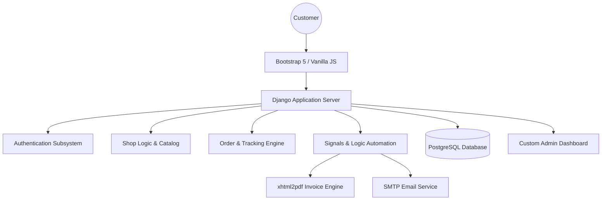
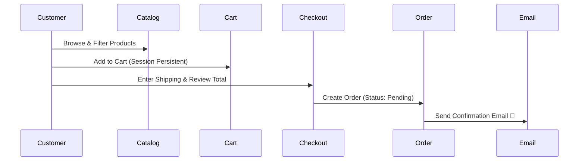

# Swiftbuy E-commerce Platform 🛍️

[](https://www.djangoproject.com/)
[](https://www.python.org/)
[](https://www.postgresql.org/)

**Swiftbuy** is a high-performance, premium e-commerce ecosystem engineered for high conversion and seamless logistics. It combines a state-of-the-art shopping experience with robust backend automation and professional customer relationship management features.

---

## �️ System Architecture



---

## 🛠️ Key Functionalities & Workflows

### 1. The Purchase Journey 🛒
Our checkout process is optimized for speed and reliability, ensuring a low abandoned-cart rate.



### 2. Proactive Logistics & Tracking 🚚
Real-time transparency is built into the core. From the moment an order is confirmed, customers can visualize its progress.

- **Live Progress Bar:** Dynamic UI tracking through 5 stages (Confirmed, Processing, Shipped, Out for Delivery, Delivered).
- **Automated Communication:** Instant email triggers for status changes.
- **Invoice Governance:** Upon delivery, a professional PDF invoice is generated and automatically dispatched to the user.


---

## 💎 Advanced Features

### � Catalog & Discovery
*   **Intelligent Filtering:** Multi-dimensional filtering by Category, Brand, Price Range, and "Featured" status.
*   **Search Engine:** Instant keyword matching across titles and descriptions.
*   **Stock Control:** Automated visibility toggle for out-of-stock items.

### 🛡️ Secure Infrastructure
*   **RBAC (Role-Based Access Control):** Dedicated portals for Customers (Profile/Orders) and Staff (Dashboard/Inventory).
*   **Session Resilience:** Shopping carts persist even for non-logged-in users until checkout.

### 📊 Custom Admin Intelligence
A bespoke **Admin Dashboard** (beyond standard Django admin) that provides:
*   **Quick Stats:** Real-time revenue, total orders, and user growth tiles.
*   **Inventory Watchdog:** Visual alerts for products with low stock.
*   **Sales Insights:** Automatic identification of best-selling products.

---

## � Technical Blueprint

| Layer | Technology |
| :--- | :--- |
| **Backend** | Python / Django Web Framework |
| **Template Engine** | Django Templating (Jinja-style) |
| **Frontend UI** | HTML5, CSS3 (Custom Premium Tokens), Bootstrap 5 |
| **Database** | PostgreSQL |
| **PDF Generation** | xhtml2pdf / ReportLab |
| **Email Service** | SMTP Integration with Branded HTML Templates |
| **Asynchronous** | Django Signals for event-driven logic |

---

## � Execution & Setup

### Prerequisites
- Python 3.10+
- PostgreSQL Instance

### Installation
1.  **Clone & Install Dependencies:**
    ```bash
    git clone https://github.com/Sivanarulanbu/shop.git
    cd ecommerce
    pip install -r requirements.txt
    ```
2.  **Environment Configuration:**
    Ensure `settings.py` is configured with your:
    - `DATABASES` (PostgreSQL credentials)
    - `EMAIL_HOST_USER` / `EMAIL_HOST_PASSWORD` (For notification system)
3.  **Database Sync:**
    ```bash
    python manage.py makemigrations
    python manage.py migrate
    ```
4.  **Static Assets:**
    ```bash
    python manage.py collectstatic
    ```
5.  **Run Server:**
    ```bash
    python manage.py runserver
    ```

### 🐳 Docker Execution
Alternatively, you can run the entire ecosystem using Docker:
1.  **Build and Start:**
    ```bash
    docker-compose up --build
    ```
2.  **Run Migrations (inside container):**
    ```bash
    docker-compose exec web python manage.py migrate
    ```
3.  **Access:**
    - App: [http://localhost:8000](http://localhost:8000)
    - Admin: [http://localhost:8000/admin](http://localhost:8000/admin)

---


## 🔐 Administrative Access
Manage your store at `127.0.0.1:8000/admin/`:
- **Admin User:** `admin`
- **Admin Password:** `admin123`

---

&copy; 2026 Swiftbuy Platform. *Defining the Future of Digital Commerce.*
